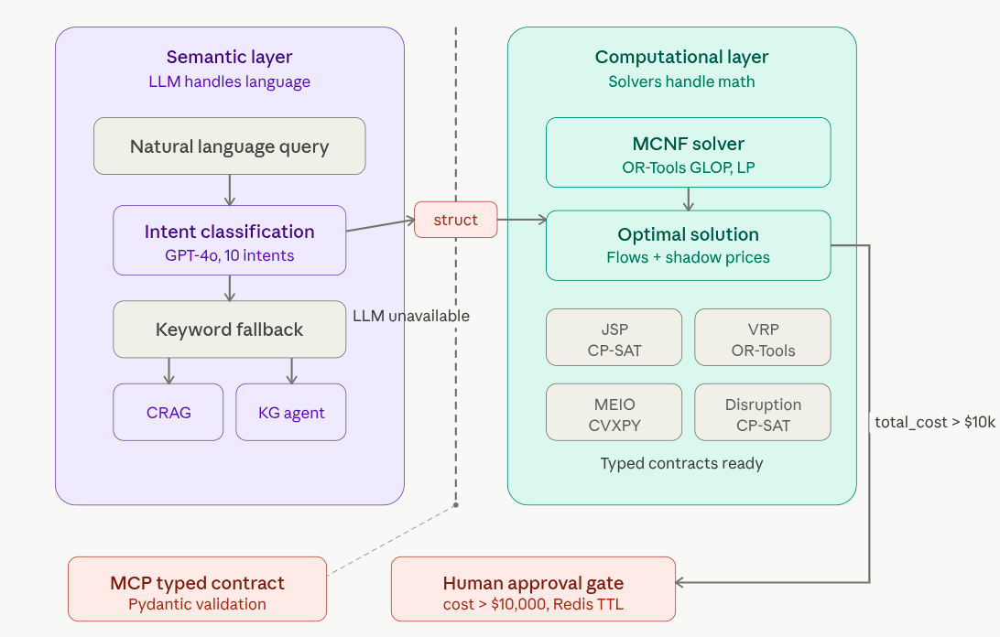
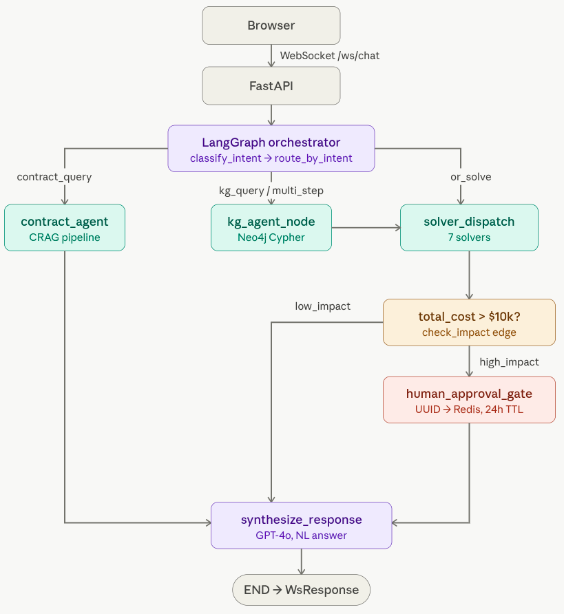
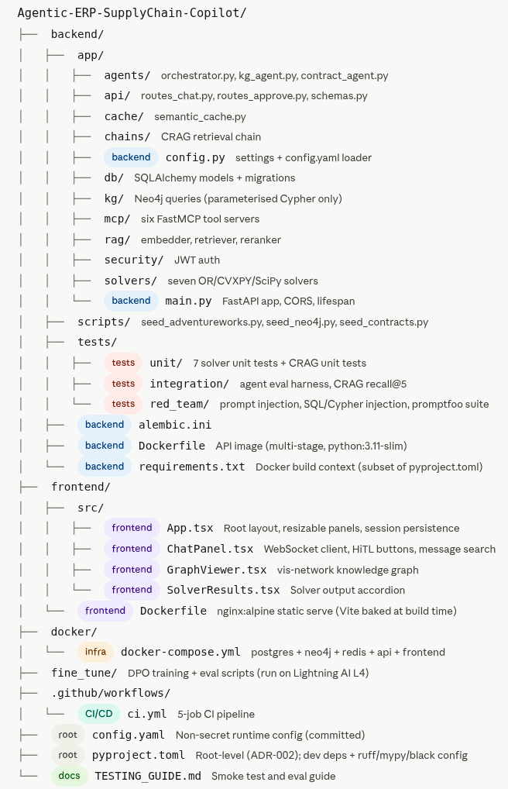

# Agentic ERP Supply Chain Copilot

> **Project 1 of 2** — Application Code, CI Pipeline, and Container Images  
> Companion infrastructure repo: [`Agentic-ERP-Deploy`](https://github.com/mnguegnang/Agentic-ERP-Deploy) (Project 2)  
> Deployed at: `http://erp.131-189-252-158.nip.io`


Agentic ERP Supply Chain Copilot is a production-grade multi-agent system that answers supply-chain queries in plain language. It pairs a **LangGraph orchestrator** and a **CRAG retrieval pipeline** with 7 deterministic solver backends **(OR-Tools, CVXPY, SciPy)**, a **Neo4j knowledge graph**, and a **human-in-the-loop approval gate**. The stack runs locally via Docker Compose and ships to **Azure Kubernetes Service** through automated CI/CD.
---

## Tech Stack

| Layer | Technology |
|-------|-----------|
| Agent orchestration | LangGraph 0.2, LangChain-OpenAI |
| LLM | GitHub Models API — GPT-4o (`models.inference.ai.azure.com`) |
| OR solvers | OR-Tools (MCNF, JSP, VRP, Disruption), CVXPY (Robust, MEIO), SciPy (Bullwhip) |
| RAG pipeline | BGE-large-en-v1.5 + BM25 + RRF + CrossEncoder rerank |
| Knowledge graph | Neo4j 5.27 (local) / 5.26 (AKS in-cluster) |
| Databases | PostgreSQL 16 + pgvector, Redis 7.4 |
| Backend | FastAPI 0.115, Uvicorn, SQLAlchemy async |
| Frontend | React 18, TypeScript, Vite, vis-network |
| Container runtime | Docker Compose (local), AKS (production) |
| CI/CD | GitHub Actions → Azure Container Registry → AKS |

---

## Architecture

### Neuro-Symbolic Boundary

<p align="center">
        
</p>


### Request Flow

<p align="center">
        
</p>

### Subsystems

**Intent Classification** — 10 intents: `mcnf_solve`, `jsp_schedule`, `vrp_route`, `robust_allocate`, `meio_optimize`, `bullwhip_analyze`, `disruption_resource`, `kg_query`, `contract_query`, `multi_step`. Confidence threshold: 0.7. Deterministic keyword fallback fires on HTTP 429 (LLM rate limit).

**CRAG Pipeline** — BGE-large-en-v1.5 embeddings → pgvector cosine + BM25 → RRF@60 fusion → CrossEncoder rerank (ms-marco-MiniLM-L-12-v2) → LLM relevance filter. Drops irrelevant chunks before synthesis.

**OR Solvers** — seven deterministic solvers, dispatched by intent:

| Solver | Library | Intent |
|--------|---------|--------|
| Min-Cost Network Flow | OR-Tools | `mcnf_solve` |
| Job-Shop Scheduling | OR-Tools CP-SAT | `jsp_schedule` |
| Vehicle Routing | OR-Tools | `vrp_route` |
| Disruption Reallocation | OR-Tools | `disruption_resource` |
| Robust Min-Max | CVXPY | `robust_allocate` |
| MEIO/GSM | CVXPY | `meio_optimize` |
| Bullwhip Amplification | SciPy | `bullwhip_analyze` |

**Human-in-the-Loop (HiTL)** — when `total_cost > $10,000`, a UUID decision record is stored in Redis (24 h TTL). The manager approves or rejects via `POST /api/approve/{id}`. The frontend renders an Approve/Reject banner live over the WebSocket.

**MCP Tool Servers** — six FastMCP servers expose typed tools to the agent: `server_erp.py`, `server_kg.py`, `server_crag.py`, `server_ortools.py`, `server_cvxpy.py`, `server_scipy.py`.

**Semantic Cache** — Redis-backed, TTL 3600 s, short-circuits full graph traversal on near-duplicate queries.

---

## Repository Structure

<p align="center">
        
</p>

---

## Local Development

### Prerequisites

- Python 3.11–3.12
- Node.js 22 LTS
- Docker Engine (CE from `download.docker.com`, not `docker.io`)
- Git

### 1. Clone and configure

```bash
git clone https://github.com/Gabin-Maxime/Agentic-ERP-SupplyChain-Copilot.git
cd Agentic-ERP-SupplyChain-Copilot
cp .env.example .env
# Fill in: GITHUB_TOKEN, PG_PASSWORD, NEO4J_PASSWORD, JWT_SECRET_KEY
# Optional: LANGSMITH_API_KEY
```

### 2. Set up Python environment

```bash
python3.11 -m venv agentic-erp-dev
source agentic-erp-dev/bin/activate
pip install -e ".[dev]"
```

### 3. Start the full stack with Docker Compose

```bash
cd docker
docker compose up -d
# Services: postgres:5432, neo4j:7474/7687, redis:6379, api:8000, frontend:3000
docker compose logs -f api     # watch API startup
```

### 4. Seed the databases

Wait for all services to be healthy, then:

```bash
python backend/scripts/seed_adventureworks.py   # AdventureWorks ERP data + pgvector embeddings
python backend/scripts/seed_neo4j.py            # 14 suppliers, 9 components, 4 products, supply-chain graph
python backend/scripts/seed_contracts.py        # 20 synthetic supplier contracts → CRAG embeddings
```

Open `http://localhost:3000`.

---

## Running Tests

```bash
# Unit tests — no external services needed
pytest backend/tests/unit/ -v --tb=short

# Integration tests — requires live Postgres + Neo4j + Redis (docker compose up first)
pytest backend/tests/integration/ -v --tb=short -m "not slow"

# Agent eval harness — use MOCK_LLM=true to avoid API quota
MOCK_LLM=true pytest backend/tests/integration/test_agent_eval.py -v

# CRAG Recall@5 gate
MOCK_NEO4J=true pytest backend/tests/integration/test_crag_recall.py -v

# Red-team injection tests
pytest backend/tests/red_team/ -v --tb=short

# promptfoo adversarial suite
cd backend/tests/red_team && promptfoo eval --config promptfoo.yaml --output promptfoo-results.json --no-cache
```

---

## Lint, Format, Type-Check

```bash
ruff check backend/ fine_tune/           # lint
ruff check --fix backend/ fine_tune/     # lint + auto-fix
black --check backend/ fine_tune/        # format check
black backend/ fine_tune/                # format
mypy backend/app --ignore-missing-imports
bandit -r backend/app -ll                # security scan
```

---

## CI Pipeline

Five jobs in `.github/workflows/ci.yml`, triggered on push and PRs to `master`:

```
backend-quality ──────────────────────────────────────────────────────┐
  ruff + black + mypy + bandit + unit tests                            │
                                                                       ▼
frontend-quality          integration-tests ──────── red-team ─────► build-and-push-images
  tsc --noEmit            (live postgres/neo4j/redis)  pytest +         Docker build → ACR
                                                        promptfoo        (master only)
                                                                              │
                                                                              ▼
                                                                       trigger-deploy
                                                                       repository_dispatch
                                                                       → Agentic-ERP-Deploy
```

**Required GitHub secrets:** `AZURE_CREDENTIALS`, `ACR_NAME`, `DEPLOY_REPO_PAT`

The `build-and-push-images` job uses OIDC keyless Azure login (`id-token: write`) — no long-lived credentials stored (ADR-014). Images are tagged with the short Git SHA and pushed as both `:<sha>` and `:latest`. The `VITE_WS_BASE_URL` and `VITE_API_BASE_URL` build args are baked into the frontend image at CI build time (Vite replaces `import.meta.env.*` at compile time — these cannot be injected at runtime).

---

## Azure Deployment

Deployment is owned by **Project 2** (`Agentic-ERP-Deploy`). Project 1's `trigger-deploy` job fires a `repository_dispatch` event to that repo with the image tags and short SHA. A manual approval gate (GitHub environment `production`) is required before `kubectl set image` runs against the AKS cluster.

**Live URL:** `http://erp.131-189-252-158.nip.io`  
**API docs:** `http://erp.131-189-252-158.nip.io/docs`

For infrastructure provisioning, deployment commands, and rollback procedures, see the [Agentic-ERP-Deploy README](https://github.com/Gabin-Maxime/Agentic-ERP-Deploy).

---

## Key Design Decisions

| ADR | Decision | Rationale |
|-----|---------|-----------|
| ADR-001 | GitHub Models API (GPT-4o) | No billing account; OpenAI-compatible endpoint |
| ADR-002 | `pyproject.toml` at repo root | `pip install -e ".[dev]"` works from CI checkout root |
| ADR-008 | HiTL threshold in `solver_dispatch_node` | `check_impact` edge ran after flag was set; moved check to setter node |
| ADR-009 | Keyword + regex fallbacks on HTTP 429 | GitHub Models free tier (50 req/day); all agent paths must work without LLM quota |
| ADR-012 | `echo` provider in promptfoo CI | Avoids LLM cost per PR; structural injection detection still valid |
| ADR-013 | DPO fine-tuning deferred to GPU computer | 24 GB VRAM required for fast fine-tuning |
| ADR-014 | OIDC keyless Azure login in CI | Short-lived tokens; no long-lived secret in `AZURE_CREDENTIALS` |

Full decision records in [`Project_Notes.md`](Project_Notes.md).

---

## HiTL Trigger Reference

Any `mcnf_solve` query where `total_cost > $10,000` triggers the Human Approval gate:

- *"Route 10 000 units from factory A to warehouse B. Arc capacity 50 000, cost_per_unit=2."* → $20 000 → HiTL
- *"Route 100 000 units from node A to node B. Arc capacity 200 000, cost_per_unit=5."* → $500 000 → HiTL

Threshold is `human_approval_cost_threshold: 10000` in `config.yaml`.

---

## Fine-Tuning (Post-M6)

Scripts in `fine_tune/` are production-ready but are not executed in CI. They require a Lightning AI L4 instance (24 GB VRAM):

```bash
python fine_tune/prepare_dataset.py    # curate LangSmith traces → preference pairs
python fine_tune/train_dpo.py \        # DPO + QLoRA (r=16, alpha=32, beta=0.1)
  --adapter ./adapter --dataset ./data --output ./output
python fine_tune/eval_tool_accuracy.py # gate: intent accuracy ≥ 90%
```

Prerequisite: ≥5,000 preference pairs from `prepare_dataset.py` and M6 eval harness passing.

---

## Related

- [Project 2: Agentic-ERP-Deploy](https://github.com/Gabin-Maxime/Agentic-ERP-Deploy) — infrastructure, Kubernetes manifests, deployment workflows
- [Developer Log](Developer_Log.md) — chronological error/fix tracker
- [Project Notes](Project_Notes.md) — architectural decision records
